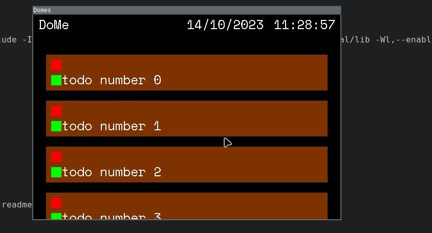

# Do-me
making a todo app bc its what cool kids do this days and i want to be a cool kid.
trying to implement a simple layout engine and apply it on a todo app :).        

**is unsafe for u RAM**

# How To Run
**u need to have sdl2 and sdl2_ttf to do the rendering of the app**
```
    $ ./run.sh
```     
# Whats Next:
the point of the is the layout engine, so for me its already done.   
but for future me or anyone who is intersted, maybe add support for:
-   edit todos
-   timed todos, means the date/month of the todos
-   github activity table to track done todos 
 


# dev-imgs
## Block UI with text

## Adding Container Logic + Scroll

## Text Input 

## The Todo App 


# Links
-   [Let's build a browser engine!](https://limpet.net/mbrubeck/2014/08/08/toy-layout-engine-1.html)

